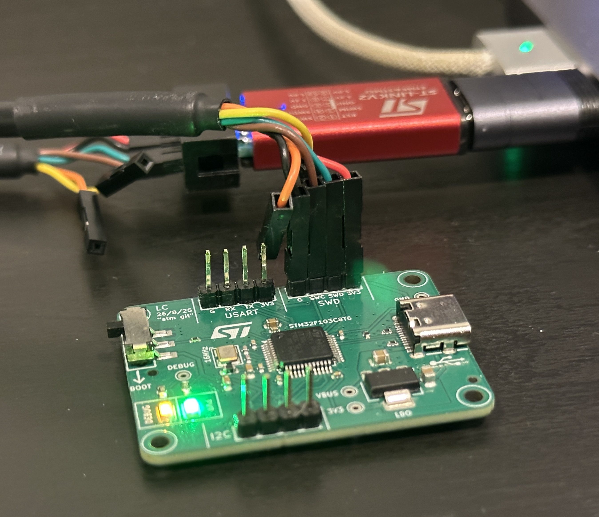

# My First STM32 Project

Simple PCB with minimum circuit plus SWD, USART, I2C and USB. Designed wholly in KiCAD 9.

---
Take a look a the fully sick 3D render:


---
..and now take a look at the fully sick assembled board:



The board's indicator LEDs are both on. The green 'PWR' LED indicates the 3V3 bus is live. The orange 'DEBUG' LED is a result of the 'blinky' routine being in the HIGH state.

---
The following is the HAL-free c script to blink the DEBUG LED

```#include <stdint.h>

int main(void) {
    // Enable GPIOC clock
    volatile uint32_t *rcc_apb2enr = (volatile uint32_t *)0x40021018;
    *rcc_apb2enr |= (1 << 4); // Set IOPCEN (bit 4)

    // Configure PC13 as output push-pull, 10 MHz
    volatile uint32_t *gpioc_crh = (volatile uint32_t *)0x40011004;
    *gpioc_crh &= ~(0xF << 20); // Clear MODE13 and CNF13
    *gpioc_crh |= (0x1 << 20); // MODE13 = 01 (output 10 MHz), CNF13 = 00 (push-pull)

    // DR Register
    volatile uint32_t *gpioc_odr = (volatile uint32_t *)0x4001100C;

    // SysTick Registers
    volatile uint32_t *systick_ctrl = (volatile uint32_t *)0xE000E010;
    volatile uint32_t *systick_load = (volatile uint32_t *)0xE000E014;
    volatile uint32_t *systick_val  = (volatile uint32_t *)0xE000E018;

    // SysTick Init
    *systick_load = (8000000 / 1000) - 1;  // Reload for 1ms tick
    *systick_val  = 0;                     // Clear current value
    *systick_ctrl = (1 << 2) | (1 << 0);   // CLKSOURCE=CPU, ENABLE=1

    // Delay Function
    void delay_ms(uint32_t ms) {
        for (uint32_t i = 0; i < ms; ++i) {
            while (((*systick_ctrl) & (1 << 16)) == 0);
        }
    }

    // Main Blink Loop
    while (1) {
        *gpioc_odr &= ~(1 << 13);  // Set PC13 LOW
        delay_ms(250);

        *gpioc_odr |= (1 << 13);   // Set PC13 HIGH
        delay_ms(250);
    }
}

